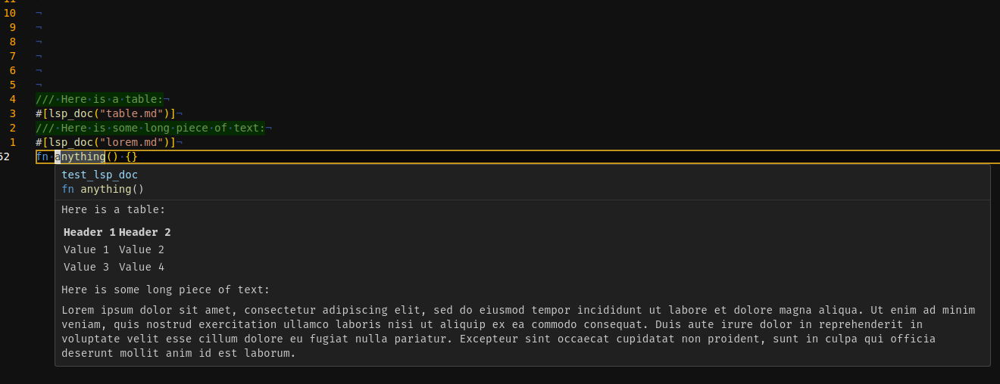
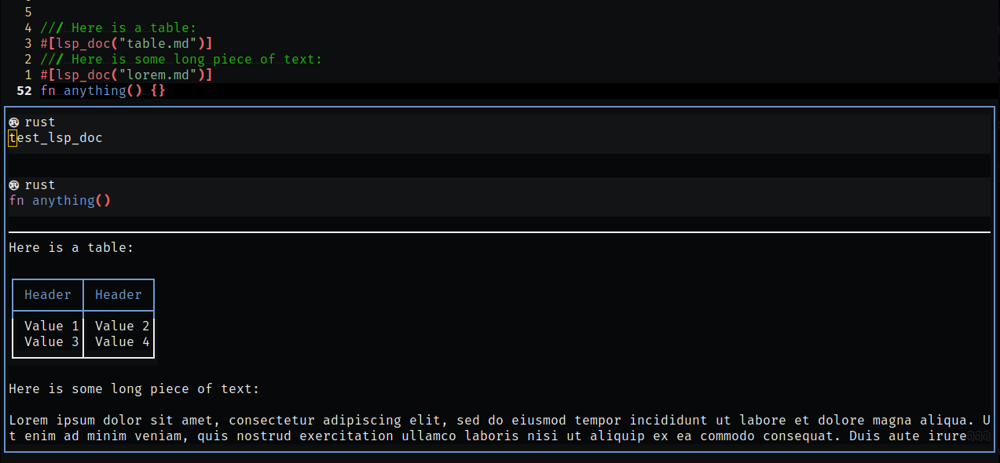

# lsp_doc

## What

This crate provides an attribute macro to embed any plain-text file (interpreted as markdown) into the Rust documentation for the LSP hover/preview for any editor.

## Why?

Currently you can say either of the following:

```rust
/// [](some_file.md)
fn some_func() {}

// or

#[doc = include_str!("../another_file.md")]
fn another_func() {}
```

However, while these work with `cargo doc`, neither of these show up in the LSP hover/preview.

This macro resolves that.

## Screenshots

Given

### `*.rs`

```rust
/// Here is a table:
#[lsp_doc("table.md")]
/// Here is some long piece of text:
#[lsp_doc("lorem.md")]
fn anything() {}
```

### `lorem.md`

```markdown
Lorem ipsum dolor sit amet, consectetur adipiscing elit, sed do eiusmod tempor incididunt ut labore et dolore magna aliqua. Ut enim ad minim veniam, quis nostrud exercitation ullamco laboris nisi ut aliquip ex ea commodo consequat. Duis aute irure dolor in reprehenderit in voluptate velit esse cillum dolore eu fugiat nulla pariatur. Excepteur sint occaecat cupidatat non proident, sunt in culpa qui officia deserunt mollit anim id est laborum.
```

### `table.md`

```markdown
| Header 1 | Header 2 |
| -------- | -------- |
| Value 1  | Value 2  |
| Value 3  | Value 4  |
```

### VSCode



### Neovim



## Note

- Paths are relative to the crate root directory
- Multiple embeds for the same item **are** supported
- Images **are not** currently supported
- File contents are cached by rust-analyzer (see section below)

## Updating a document

If you frequently edit the embedded file, you will not see immediate updates.

To force an update, you need to save the file or restart the language server (in VSCode: `Ctrl+Shift+P` -> `Rust analyzer: Restart server`)
